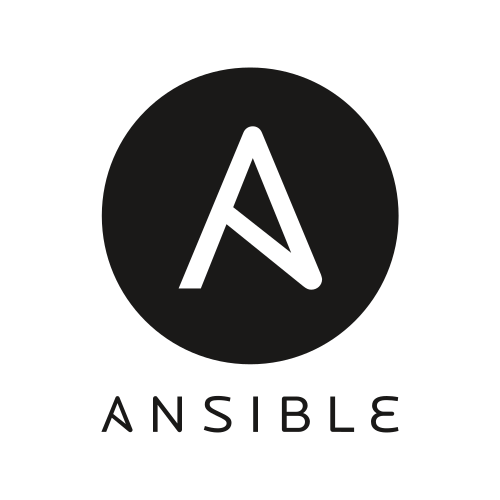

  

    
  

 
 

<h2 align=center>Hi! I'm Vincent Boillot Devalliere.</h2>
<h3 align=center>Computer Science Student and hopefully soon DevOps Engineer</h3>
 

As a Computer Science student with a passion for DevOps Engineering, I strive to create seamless and efficient systems that enhance the user experience. With a keen eye for detail and a background in programming, I understand the importance of meeting deadlines and clear communication to ensure the successful delivery of projects. I am dedicated to making businesses' visions come to life by leveraging my skills in automation, continuous integration and deployment, and cloud technologies to create robust and scalable infrastructure.

 

Let's work together! Send me a <a href="https://twitter.com/Bois_Leau" rel="noopener noreferrer" target="_blank">text!</a>

 

## Languages & Database:

 

## Cloud :

 

## Tools:

 

<h2 align="left">Connect with me:</h2>

 

